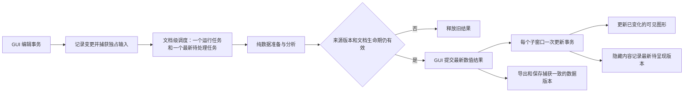

# MetrologyWorkspace 控件响应优化完整方案

编写日期：2026-10-07。状态：部分实施；原始方案保留，当前进展见[实施与验证记录](control-responsiveness-results.md)。

本方案以编写时源码和两轮实测为依据。下文是原始方案，不代表所有阶段已经完成。建议顺序是：先修正确性竞争并减少重复工作，再把纯数据计算移出 GUI 线程，随后处理图形更新、脏状态/快照和大文件打开。每阶段应能单独验证、单独回退。

## 目标和现状

当前 7,731 行 NOVA 的单元格编辑已观察到约 0.9–1.8 秒；打开 Correlation/Trend 和 Map 后约 3.5–7.3 秒。Mapping 直接回调很快，排队后的分析与图形工作仍阻塞主线程。子窗口隐藏后工作量不减少，Final 编辑还会重新加载源表未变的 Preview Map。拟合本身在采样中很小，主要开销是重复的身份/参与处理、状态复制、选择计划和图形创建。已有一条旧 Fit-width 回调能覆盖显式视图恢复的确定触发路径。

优化必须同时改善三件事：控件及时响应；当前结果及时计算完成；科学计算及文档行为保持正确。结果需要一秒完成，并不要求 GUI 冻结一秒。反之，按钮先返回、随后线程排队冻结，也不算达标。

以下是建议的验收目标，需要实施时在同一机器、固定夹具与设置下确认，不是已经实现的性能承诺：

| 指标 | 建议目标 |
| --- | --- |
| 普通单元格编辑、Mapping 操作的直接回调 | 热态 P95 ≤ 50 ms |
| 热态日常操作的 GUI 心跳间隔 | P95 ≤ 50 ms，正常峰值 ≤ 100 ms；重复 > 250 ms 单列阻塞缺陷 |
| 7,731 行、3 参数、仅主窗口的编辑/Mapping 结果就绪 | P95 ≤ 500 ms，包括排队、准备、计算和结果提交；不含图表完成 |
| 两个联动子窗口打开后的最新可见内容就绪 | 首轮目标 P95 ≤ 1 秒；未达到时仍须满足 GUI 心跳目标并继续定位 |
| 批量替换及 Undo | 同样保持界面响应，计算/呈现分别报告；批量改变一列和所有映射列均须覆盖 |
| WKB 和已保存子图窗首次打开 | 100 ms 内显示“正在加载/恢复”；总加载时间单列冷态/热态测量，不用占位页冒充完成 |
| 内存/生命周期 | 反复编辑、开关窗口后无随次数持续增长的残留，缓存和任务队列有明确上限 |
| 数值、源数据、保存与视图 | 功能合同通过；既有性能门槛保留，不能靠放宽预算完成 |

离屏 Qt 的心跳不能替代真实 Windows 拖动、滚动和显示帧率。结果就绪、子窗口数据就绪、可见图表完成是三个不同时间点，都必须记录。

## 总体模块设计

GUI 线程负责 Qt model、控件、编辑器提交、选择和结果呈现。纯输入准备模块负责原始字符串的计算副本、身份键、measurement sets、参与行、分组和数值列。现有 matching 计算模块负责 Card、Bias、Summary 和派生结果。一个文档级调度模块合并请求、保留最新任务并拒绝旧结果。子窗口通过一个更新 interface 接收完整、已准备的输入；绘图模块只消费结果与呈现描述。

建议只深化现有 `matching`、`GroupPlan`、`SheetModel` 和子窗口更新的 seam，不先做全目录搬迁或通用框架。需要新增的调度模块对外只暴露请求、取消和结果就绪，不让窗口学习 executor、队列和缓存的内部细节。

同一输入版本的身份/参与准备应共享，但 worker 和历史接受基准不得引用 GUI 可以修改的缓存。`dataclass(frozen=True)` 只冻结字段赋值，不会让里面的 DataFrame 自动不可修改；快照必须有明确所有权，数值缓冲可用只读数组，外部读取继续保留原有隔离语义。

## 阶段 0：冻结测量基线，先修视图竞争

记录本阶段开始的源码、夹具哈希、运行时版本、主题、字体、活动页、已打开窗口和恢复周期。保留用户既有未提交工作，以这份工作区状态作为后续回退基准。将已有临时反馈环转成正式的公开 interface 回归测试。

把 `PlotPage.resizeEvent` 的 Fit-width 重排改为 QObject 拥有、可取消、可合并的布局任务。任务执行时必须再次确认当前缩放方式和最新视图意图。显式 `restore_view`、百分比缩放、用户滚动/平移应使更早的自动 fit/center 任务失效；数据 SurfaceJob 的 revision 不能替代视图意图版本。

验收：两次已复现的 200%/横向 70 → 436 触发路径转绿；没有旧回调时的对照也通过；Map 数据更新、字体/色条变化、窗口 resize、切 selector/canvas 和分页后仍保持正确视图。重新复查长会话测试中的 1733 偏移，不能仅凭受控路径修好就宣称所有竞争消失。

涉及 `plot_page.py` 与对应 Map/匹配窗口测试。此阶段不触碰数值计算、保存格式和刷新算法。

## 阶段 1：保留编辑差异，准备真正可复用的输入

在 `SheetModel` 的编辑事务中保留变更摘要：单元格/表头/结构/替换，受影响行列、逻辑源行数、原位编辑或替换语义。先增加与现有通知兼容的 interface，再迁移热路径消费者；由接受数据变化的模块统一推进版本，避免各窗口自行猜测。

按依赖区分来源内容、身份输入、参与/分组、mapping、呈现及接受基准。版本是运行时信息，不写进 WKB。普通数值变化先使依赖该列的计算和筛选失效；若数值筛选改变了参与行集合，还必须使所有依赖该分析范围的 Card/统计失效，即使其他列数值没有变。身份列、行序、表头或结构变化再使相应身份/measurement 缓存失效。若一列失去或获得数值资格，更新相关选择描述，不能盲目复用旧控件结构。

保持现有源表字符串和行序。计算用数值数组是派生表示，不替代持久化原表。`34.0` 改成 `34.000` 即使计算值相等，源表显示、dirty、保存和导出仍要反映新的原始字符串；数值缓存命中不能吞掉这次编辑。数值编辑、整表替换、清空末尾记录和 Undo 必须走各自已有身份规则；整表替换不能套用单元格的按位置保留规则。

一次输入事务只规范化有效 grouping/participation 状态、转换所需数值列、准备身份与范围一次。缓存包含真实来源列名、stage、参与/筛选依赖、单位/展示描述；相同数值但不同列名不能留下旧标题。父窗口的 mapping 控件在表头、结构或列资格不变时复用，更新数值结果而非全部重建 combo/limit 控件。

先实现文档内、有限大小的准备缓存：当前输入和必要的接受基准/正在运行任务；每次编辑不无限追加历史。公开 DataFrame 读取仍要隔离调用者修改。未知或未追踪的变更走完整准备，不能为了快漏掉验证。

验收：普通数值编辑不重复准备未变的身份键或重建 mapping 结构；身份字段编辑、重排、空尾行、排除记录、重复身份和 Undo 结果与现有计算一致。新增纯准备模块测试从真实输入到完整输出验证，调用次数只作为诊断指标，不把内部实现形状写成大量脆弱测试。

涉及 `sheet.py`、`matching_window.py`、`match_groups.py`、`measurements.py`、`matching/analysis.py`。

## 阶段 2：每个子窗口只提交一次完整更新

为子窗口增加一次接收完整更新的 interface，隐藏来源、参与、分类、选择恢复的执行顺序。事务中所有中间 setter 都禁止发布临时 plan 和触发自动绘图，结束时只发布一份最终一致的选择计划；Correlation/Trend 各自的选择网格按真正变化更新一次。

同一父事务构造一次当前 workbook/准备结果，按每个窗口实际来源生成更新描述。Preview Map、Final Map、当前 Correlation 及独立 Dynamic 的来源规则分别判断。Final 数值编辑不应重新载入未变的 Preview Map 表，但仍更新确实改变的 Card 或共享参与信息。

将“源表有变”“参与/分类有变”“Card 有变”“展示/选择有变”分开。只有内容变化才替换子 model；只更新 Card 时更新对应提供者和说明，不能顺带重新加载整表。独立修改的子稿继续受到保护，Use Workbook Data 的现有确认行为保留。

隐藏窗口与非活动页保留最新逻辑输入和待呈现版本，延后识别、网格与图形的重工作。不能只暂停任务而留下可保存/可导出的旧数据：子窗口打开、复制、导出或保存时，按实际保存合同刷新所需最新内容；Pending Draw 的人工选择仍等待 Draw selected。

验收：当前一轮编辑的 7 次 Correlation plan/16 次 selector 更新收敛为一次一致提交与每个发生变化的页面一次网格更新。可见、隐藏、独立子稿、同源表但新 Card、共享轴、恢复中未打开的子稿都必须覆盖。性能用原始 NOVA 的 parent/linked/hidden 路径分别比较。

涉及 `matching_window.py`、`window.py`、`correlation_window.py`、`map_selector.py`，以一个完整更新 interface 替代调用者必须知道的多次 setter 顺序。

## 阶段 3：文档级最新任务调度，计算与 GUI 提交分离

GUI 侧短事务提交编辑、记录变更、捕获独占输入。使用短暂合并窗口收拢连续粘贴/勾选；建议从 75–120 ms 实测起步。合并只减少重复请求，后台计算才负责避免长阻塞。保留“用户已运行过分析才自动更新”和未 Apply 的 Group 设置规则。

每份文档最多一个运行分析和一个最新待处理请求。新编辑替换待处理任务；当前 worker 在安全检查点取消或继续完成后丢弃旧结果，不能强制杀 Python 线程。结果带来源/分析版本、scope 和文档生命期；过期任务、关闭文档、切换来源、取消打开或无效最新输入都不能发布。

把当前 `run_analysis` 的纯准备/计算和 GUI/图形提交拆开。Qt model、widget、selection model、字体测量及画布只在 GUI 线程操作。纯 worker 接收独占 plain state/frames/arrays，不调用 `current_workbook()` 等读控件函数。数值结果就绪后先提交 Summary/Card，再调度图形更新；“计算结果当前”和“图形已呈现”分别跟踪。

先用线程 adapter 验证可响应性，保留确定性的同步参考执行用于等价测试。若 CPython/GIL 或某个持有 GIL 的调用仍造成长 GUI 间隔，再用同一 pure-data interface 实测单个持久进程 adapter。进程方案需验证 Windows spawn、导入成本、序列化成本和峰值内存；线程/进程选择依据测量，不依据抽象偏好。

错误保持原编辑和可辨认的上一版图，明确提示结果待更新/输入无效。合法草稿继续可以保存；需要最新计算结果的导出应等对应版本完成后继续，不能导出新源数据配旧 Card。禁止用阻塞 GUI 的 `Future.result()` 或反复 `processEvents()` 等待计算。

验收：连续 20 次编辑、立即 Undo/Redo、Mapping 快速切换、Group pending、切 Preview/Final、打开/关闭子窗、任务报错和立即导出均得到最新一致结果；慢旧任务后返回也不能覆盖快新任务。GUI 心跳和完成时间独立达标，队列和缓存内存有上限。

## 阶段 4：增量图形、分批呈现与必要的独立 Map 渲染

PyQtGraph 复用已存在的 PlotWidget、轴、legend、curve、标记和可兼容的选择项。普通数值变化更新数据；身份/分组/源列或布局改变时才重建对应描述。保留 zoom、panel 顺序和 dock 状态。measurement span、Die Seq 标签、分隔线位置在未变的身份输入下复用。

Trend 的大量边界线可评估批量图形项，保留全部边界位置、线型、坐标关系和自动范围；不删点或降低计算数据量。大网格只更新变化的 item/启用状态。样式变更沿用已有快路径，避免再绘一次源数据。

GUI 绘图按可见 panel/页排队，先呈现当前可见结果，再分批填充其他内容。批次目标从 8–16 ms 时间预算实测；若单个原子绘制操作自身超预算，必须继续拆解或迁移准备，而不是只把整次绘图放进零延迟 timer。展示队列也只保留最新版本。

Map 继续分离已存在的插值 worker 与主线程呈现。先复用 surfaces、背景和 artists，只有色条等实际改变布局的选项才重排；字体/覆盖层更新不重新插值。保留原 resolution 与 PNG/vector 导出合同。

如果经过复用后，单次 Matplotlib 画布绘制仍超过 GUI 间隔目标，作为后续独立阶段评估专属进程内的 Agg 渲染：进程独占 figure/artist，输出屏幕图像和命中/坐标描述，GUI 只接收图像并处理交互；矢量/高分辨率导出仍使用完整数据与既有算法。不能把现有 Qt canvas 或 live Matplotlib artist 直接交给 worker。此分支需额外验证 hover、缩放、颜色、标签、坐标变换、复制/导出和像素等价，不与首轮输入优化捆绑。

验收：相同点数、source rows、拟合系数、轴范围、legend、单位、色阶与导出数组；新旧 light/dark、窄窗口、高字体、分组、单/双轴和全部页都比较。以实际可见图形完成时间和 GUI 最大间隔检验，不能只计 draw_button 返回时间。

涉及 `sequence_page.py`、`correlation_page.py`、`matching_window.py`、`match_group_ui.py`、`plot_page.py`、`plotting/*`。

## 阶段 5：低成本 dirty 判断、一致快照和受控持久化

把 source、mapping/group/参与和 UI 呈现的 dirty 片段分别跟踪。普通 checkbox/font 操作只比较受影响的片段；整体文档比较保留在 Save/Close/Load、未知变更等必要位置作为保护。必须先覆盖所有状态写入口，再启用快速路径。

运行时版本号只用于新鲜度，不能直接等同于未保存：Undo 回到接受基准仍必须 clean。可以维护相对接受基准的变更集合或片段内容指纹；未知路径回退完整 `same_snapshot`。子窗口局部轴设置与父级共享设置、父/子基准仍分别处理。

自动恢复继续复用当前的有界后台 writer，减少 GUI 重复捕获和规范化。冻结一次并明确持有者，重复请求仍只留最新 marker。共用纯载荷比较/组装实现，使用具名 request 字段，避免同步/自动两条路径因字段变化产生不同语义。

关闭/Discard/Save/Open 与恢复发布的竞争继续由文档 owner 决定。保留独占锁、完整文件 revision/SHA 核对、原子替换、backup、候选文件隐藏和失败清理；失败不得接受基准或丢编辑。工作线程只准备候选，不能读取 Qt 状态或自行接受文档。

Excel/PNG 导出优先改善：GUI 捕获对应最新分析版本的源表/数值结果/展示选择，写出或渲染在后台；结果冻结后用户继续编辑，不修改已捕获导出内容。正式 WKB Save 后台化作为单独后续阶段，保留“持久写成功后才接受”的现有合同；保存期间新编辑继续 dirty，关闭必须等待保存决定实际完成。普通 Save 草稿不应被强制 Run；导出需要当前计算结果时则不能绕过一致性检查。

验收：编辑后立即导出、保存中再编辑、失败/取消保存、父 Save、子 Save、独立副本、恢复、关闭 Cancel、Undo 回 clean、同文件别名与冲突保护。GUI 快照捕获和写盘完成分别计时；恢复周期沿用用户已保存设置。

## 阶段 6：大文件打开、最近文件菜单与长会话验证

WKB 的读取/解析/纯验证放到独立任务，先呈现正在加载状态，原文档保留到新候选成功且替换决定被接受。取消/读取失败/文件在读取中改变不损坏旧文档；接收时复核文件 revision 和文档生命期。

恢复表与分组/来源 key 后，只应用一次保存的 UI 和 Draw 状态；当前可见页优先呈现，隐藏图形延后构建，源表和保存合同仍保持正确。轻量窗口的首次可用与全部已保存图完成分别报告。对冷导入单独采样，优先分离纯计算导入与 UI 构造，避免通过启动时大量预加载转移用户可见卡顿。

最近文件菜单是另一个待测入口：当前实现会对候选路径调用完整 `load_workspace`。菜单只需要容器类型等元数据，可做最小只读查询；真正打开时继续完整验证。元数据失效与错误文件、旧格式分开处理，不能用未经校验的缓存替代正式读取。

最后跑真实 Windows 长会话：反复编辑/粘贴/Undo、Mapping、Group、Draw、开关窗口、滚动缩放、保存恢复和导出，追踪心跳、原生 QWidget/menu、图形项、RSS、缓存和 pending task 数量。关闭后完成 deferred deletion 与任务清理，再判断是否残留；单次 Python allocation peak 不等于泄漏。

## 贯穿各阶段的正确性合同

- 保存源字符串、表头、原始行序、空尾行及映射；计算表示不替换存储表示。
- 原位编辑和整表替换采用各自身份规则，participation ID 唯一，排除不删记录，Combined Group 行去重。
- 保留 Preview/Final、NOVA/KLA/TEM 和独立 Dynamic/子稿的实际来源与归属规则。
- 保留 Card、Bias、Bias %、R²、非有限值、阈值边界、单位和参数资格规则；复用不得改变数值运算及顺序。
- Ref/Raw 选择独立，Pending Draw 与首次默认选择不改变，隐藏/懒呈现不偷偷 Draw 新选择。
- 新来源、结果、表格和导出必须对应同一捕获版本；较旧任务不能覆盖新编辑、Undo 或关闭。
- 保留 zoom/scroll、参数顺序、分页和共享轴；范围变小时允许按现有规则夹紧，不能任意重新居中。
- 保留父/子接受基准、Save/Discard/Cancel、原子存储、锁、backup、revision 和别名保护。

## 验证与交付门槛

每个阶段先在稳定的公开 seam 写能抓住真实触发模式的测试，再实施最小改动；BDD 场景链接实际测试。保留已有独立数值公式、源字符串、完整 snapshot 往返及视觉验证。新 seam 的测试覆盖输入到输出，不靠检查私有缓存字段来证明正确。

性能夹具至少包含：七个桌面 WKB（含合法 draft）、三个 CSV、7,731 行三参数 NOVA 的 parent/linked/hidden 状态、9,000 行/33 列的 grouped Trend、16,000 个 selector choices；还要测改变全部映射列的批量替换，不能只替换整表但改一个值。

before/after 使用同一脚本、数据、设置、窗口尺寸、活动页和打开窗口集合；记录源码/数据 hash。冷启动至少三个独立进程，热态至少 30 次操作并记录 P50/P95/最大值。worker 准备、数值结果提交、可见绘图完成、GUI gap、峰值/稳定内存分别报告。cProfile/tracemalloc 只归因，与未开启它们的验收计时分开。

每阶段运行最小相关测试，之后运行 `python run_tests.py`；设置和 recovery/cache 指向授权 scratch，源 WKB/CSV 和用户设置不写入。上一轮全套仍是 522 项、8 fail、1 error：七项时限、一个视图状态、一个 Windows `os.link` 权限错误。实施后必须重新完整验证；环境不能执行硬链接保护时保留测试并在支持环境复核，不算已验证通过。

真实 GUI 验收至少持续 20–30 分钟，覆盖直接操作、快速连续操作和计算中再操作。相同来源内容回到基准后 clean；跨文档/退出/worker 出错不丢草稿；完成后无 stale task 继续改变 UI。

## 实施顺序与回退

| 批次 | 范围 | 进入下一批的条件 |
| --- | --- | --- |
| 第一批 | 阶段 0、1、2 | 视图竞争反馈环转绿；来源/身份/子稿合同通过；更新次数与实际耗时有受控改善 |
| 第二批 | 阶段 3、4 | 最新结果调度、GUI gap、可见绘图与立即导出合同通过 |
| 第三批 | 阶段 5、6 | dirty/恢复/保存/open 一致性和长会话验证通过 |

每个阶段单独记录补丁/变更集和验证数据，只回退该阶段的新增改动，保留用户既有未提交工作。过期结果、安全存储和源数据隔离的保护随实施保留。若缓存、调度或绘图更新导致无法解释的输出差异，回到上一阶段的已验证实现，而不是修改算法或放宽测试。

首批实施推荐停在阶段 0–2 形成可审核成果，再用测量决定 worker 与渲染的细分工作量。完整目标仍包含第二、三批；首批更快不等于已经完成非阻塞目标。

方案依据：[初轮分析](<C:/Users/Yuanhao Qin/.codex/visualizations/2026/10/07/01a1148a-4d1c-7e10-8030-82c61abd78e9/lag-analysis/analysis.md>)、[五个 skill 的补充诊断](<C:/Users/Yuanhao Qin/.codex/visualizations/2026/10/07/01a1148a-4d1c-7e10-8030-82c61abd78e9/lag-analysis/supplement.md>)、当前 [AGENTS.md](../../AGENTS.md)、[CONTEXT.md](../../CONTEXT.md) 和 [ADR 0003](../adr/0003-typed-workspaces-and-independent-copies.md)；模块设计使用 [codebase-design](<C:/Users/Yuanhao Qin/.codex/skills/codebase-design/SKILL.md>)。所有量化目标均为建议验收值，未来实现需实测，不是速度保证。
